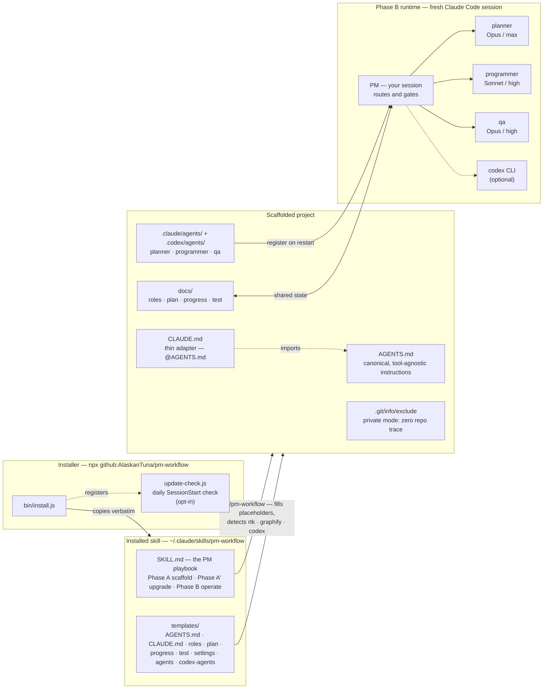
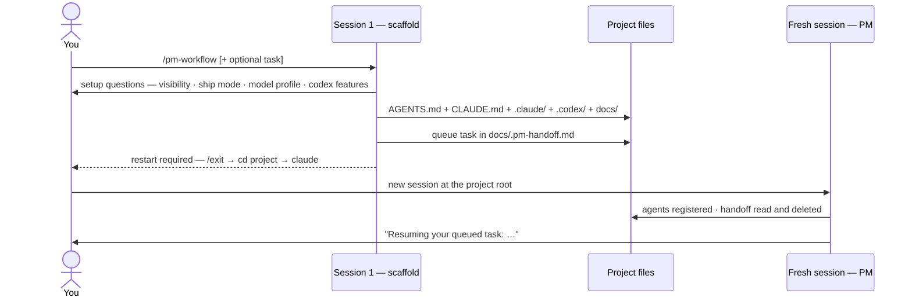
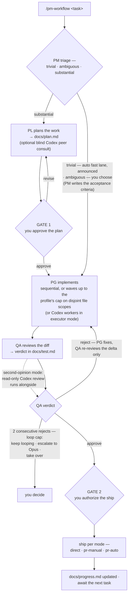

<a id="readme-top"></a>

<!-- PROJECT HEADER -->
<div align="center">

  <h3>pm-workflow</h3>

  <p>
    <b>A PM-orchestrated, role-based agent workflow skill for <a href="https://docs.claude.com/en/docs/claude-code">Claude Code</a>.</b><br />
    Spend reasoning at the bookends (plan + review), run cheap in the middle (implement).
  </p>

  <!-- Tech badges -->


  <!-- Quick links -->

[Install](#installation) · [How It Works](#how-it-works) · [Architecture](#architecture) · [Claude Code Docs](https://docs.claude.com/en/docs/claude-code)

</div>

<!-- TABLE OF CONTENTS -->

## Table of Contents

<details>
  <summary>Expand</summary>
  <ol>
    <li><a href="#about-the-project">About The Project</a></li>
    <li><a href="#how-it-works">How It Works</a></li>
    <li><a href="#features">Features</a></li>
    <li>
      <a href="#architecture">Architecture</a>
      <ul>
        <li><a href="#the-skill-architecture">The skill architecture</a></li>
        <li><a href="#the-scaffold-lifecycle">The scaffold lifecycle</a></li>
        <li><a href="#the-task-pipeline">The task pipeline</a></li>
      </ul>
    </li>
    <li><a href="#configuration">Configuration</a></li>
    <li><a href="#optional-assists">Optional Assists</a></li>
    <li>
      <a href="#getting-started">Getting Started</a>
      <ul>
        <li><a href="#prerequisites">Prerequisites</a></li>
        <li><a href="#environment-setup-ubuntu--debian">Environment setup (Ubuntu / Debian)</a></li>
        <li><a href="#installation">Installation</a></li>
      </ul>
    </li>
    <li><a href="#updating">Updating</a></li>
    <li><a href="#uninstall">Uninstall</a></li>
    <li><a href="#project-structure">Project Structure</a></li>
    <li><a href="#license">License</a></li>
    <li><a href="#acknowledgments">Acknowledgments</a></li>
  </ol>
</details>

<!-- ABOUT THE PROJECT -->

## About The Project

> _"Spend reasoning at the bookends (plan + review), run cheap in the middle (implement)."_

Invoke `/pm-workflow` in any project and the current session becomes the **PM (orchestrator)**. It scaffolds the workflow, then sequences three subagents — each pinned to its own model and effort — with **human approval gates** after planning and after QA. The PM routes and gates; it never implements.

| Role                    | Model / Effort                               | Drives on                                                  |
| ----------------------- | -------------------------------------------- | ---------------------------------------------------------- |
| **PL** Planner          | Opus / max                                   | `brainstorming`, `writing-plans`                           |
| **PG** Programmer       | Sonnet / high                                | `test-driven-development`, `executing-plans`               |
| **QA** Reviewer         | Opus / high                                  | `code-review`, `systematic-debugging`                      |
| **PM** Orchestrator     | your session model (Opus / high recommended) | routes, holds the gates                                    |
| **CX** Codex (optional) | OpenAI Codex CLI                             | per enabled feature: `second-opinion` · `peer-consult` · `executor` |

pm-workflow is **Claude Code-first, Codex-second**: on Claude Code the full experience runs as named subagents pinned to per-role model + effort, orchestrated by the PM session with the two human gates; on **Codex** the same roles run as native `.codex/agents/` subagents with the same pinning, gates, and docs. The scaffolded contract is also **portable**: canonical instructions live in a root `AGENTS.md` (the cross-tool standard, imported by a thin `CLAUDE.md` adapter), so any other agentic tool (Antigravity, Cursor, …) opened at the project root can follow the same roles, docs, and gates in a single context.

Codex delegation is **opt-in per project and per feature** (multi-select at scaffold, only offered when the `codex` CLI is installed; applies only when the main agent is Claude): `second-opinion` — a read-only review alongside QA; `peer-consult` — a human-triggered blind consult at planning; `executor` — Codex workers implementing tasks. Each gates independently.

<p align="right"><a href="#readme-top">&uarr;</a></p>

<!-- HOW IT WORKS -->

## How It Works

Three steps: scaffold once, restart once, then every task runs the gated pipeline.

### 1. Scaffold — Set Up the Crew

In a new project, run `/pm-workflow` and answer the few setup questions (**workflow visibility** first, then the **Gate 2 ship mode**, the **model profile**, and the **Codex delegation features** (multi-select) if the codex CLI is installed — see [Configuration](#configuration)). Dependency detection and resolution run **before** anything is written, so what gets scaffolded reflects your real tool state. It creates:

- a root `AGENTS.md` (canonical instructions) + `CLAUDE.md` (thin adapter that `@`-imports it),
- `.claude/` — `settings.local.json` and `agents/{planner,programmer,qa}.md`,
- `.codex/agents/` — `{planner,programmer,qa}.toml`, native Codex mirrors of the same roles,
- `docs/` — roles, plan, progress, test.

The scaffolded `AGENTS.md` embeds the full Karpathy coding guidelines, plus the complete RTK command reference and Graphify instructions if those CLIs are installed on the machine.

### 2. Restart — Register the Agents

Open a **brand-new session at the project root** (`/exit`, `cd` into the project, start `claude` again). This is required once so the new subagents register — resuming the same chat will _not_ pick them up, and per-role `effort:` pinning only applies to named dispatches. If you gave a task alongside the scaffold request, it's **queued in `docs/.pm-handoff.md`** and the fresh session resumes it automatically.

```
/exit
cd <project root>
claude
/pm-workflow
```

### 3. Run Tasks — The Gated Pipeline

`/pm-workflow <task>`. The PM runs **plan → Gate 1 (you approve) → implement → QA → Gate 2 (ship)**. Every session after the first works with no restart. See [The task pipeline](#the-task-pipeline) for the full picture.

<p align="right"><a href="#readme-top">&uarr;</a></p>

<!-- FEATURES -->

## Features

- 🎭 **Role-pinned subagents** — planner, programmer, and qa each pinned to their own model + effort via the **model profile matrix** (`max`/`balanced`/`economy`), covering both Claude and Codex models per role plus the parallel-wave cap. Planning errors are the costliest to unwind; execution is cost-right; review catches subtle bugs.
- 🧭 **Harness-aware** — the skill identifies its own main agent first: Claude Code dispatches named `.claude/agents/` subagents; a Codex main dispatches its native `.codex/agents/` TOML subagents (never pricier Claude ones); anything else runs the same roles, docs, and gates sequentially.
- 🚦 **Two human gates** — you approve the plan (Gate 1) and authorize the ship (Gate 2). Nothing bypasses QA or Gate 2, ever.
- ⚡ **Fast lane (auto-triaged)** — the PM triages every task: trivially small (typo, one-liner, doc/config tweak) → fast lane **automatically**, announced in one line; ambiguous → it asks; substantial → full pipeline. The fast lane skips planning and Gate 1, but QA + Gate 2 still always run.
- 🌊 **Parallel waves** — the planner annotates each task with its file scope and dependencies; independent tasks with disjoint scopes run as Gate-1-approved waves of up to the profile's wave cap of programmers (or Codex workers, in `executor` mode) concurrently. The full test suite runs once, at QA.
- 🔁 **Loop cap** — after 2 consecutive QA rejects on a task, the PM stops and asks you: keep looping, escalate the fix to Opus, or take over.
- 🔎 **QA efficiency** — reject-loop re-reviews check the fixes + delta diff only, not the whole change again.
- 🤝 **Codex delegation (opt-in, per-feature, hardened)** — when the main agent is Claude, pick any combination of three independent features: `second-opinion` (a read-only review alongside QA with both verdicts at Gate 2, disagreements highlighted), `peer-consult` (a **blind** planning consult for high-stakes tasks — planner and Codex get the same brief independently, neither sees the other's answer, and the planner synthesizes both with the disagreement map shown at Gate 1), and `executor` (Codex workers implementing tasks under the full PG contract). Every `codex exec` call follows a hardened invocation contract — pinned model + reasoning effort, closed stdin (the documented non-TTY freeze bug), hard timeout, and JSON-event liveness monitoring — so a hung Codex never stalls the pipeline.
- 🕶️ **Private visibility** — every artifact is excluded via `.git/info/exclude`, so your personal workflow leaves **zero trace** in a repo you're contributing to.
- 🚢 **Three ship modes** — `direct`, `pr-manual`, `pr-auto`; PR modes open a PR only for substantial changes, and merged branches are cleaned up (`--delete-branch`).
- 🧳 **Portable contract** — canonical `AGENTS.md` + thin `CLAUDE.md` adapter; other agentic tools follow the same roles, docs, and gates.
- 🔄 **Auto-update + scaffold upgrade** — opt-in daily SessionStart update check; already-scaffolded projects get a guarded template refresh (your customizations are flagged, your content files never touched).
- 🧰 **Graceful degradation** — optional skills and CLIs are assists, not requirements; each role does the same work inline when they're absent.

<p align="right"><a href="#readme-top">&uarr;</a></p>

<!-- ARCHITECTURE -->

## Architecture

pm-workflow is three layers: an **npx installer** that copies the skill into Claude Code's skills directory, the **skill payload** (the PM playbook + file templates), and the **per-project scaffold** those templates produce — which is what the named subagents actually run against.

<details>
  <summary><strong>The Skill Architecture</strong></summary>

### The Skill Architecture



The subagents run in **isolated contexts** and return summaries; the shared state is the `docs/` files. That keeps the PM's context lean — it routes on summaries, never re-reads the whole codebase.

</details>

<details>
  <summary><strong>The Scaffold Lifecycle</strong></summary>

### The Scaffold Lifecycle

Scaffolding and operating are **two different sessions** by design: `.claude/agents/*.md` written during the scaffold session aren't in the agent registry yet, and the registry loads from the working directory at session start.



</details>

<details>
  <summary><strong>The Task Pipeline</strong></summary>

### The Task Pipeline

Every task runs the same gated loop. Diamonds are decisions **you** own.



</details>

<p align="right"><a href="#readme-top">&uarr;</a></p>

<!-- CONFIGURATION -->

## Configuration

Everything is chosen **per project at scaffold time** (the PM asks only what it can't detect) and recorded in the scaffolded `AGENTS.md`:

| Choice                  | Options                                                  | Notes                                                                   |
| ----------------------- | -------------------------------------------------------- | ----------------------------------------------------------------------- |
| **Workflow visibility** | `private` (default) · `shared`                           | Asked first — it changes how everything else is written.                |
| **Gate 2 ship mode**    | `direct` · `pr-manual` · `pr-auto`                       | Plus the target branch (default `main`).                                |
| **Model profile**       | `max` · `balanced` · `economy`                           | One knob: Claude + Codex models per role, pinned efforts, wave cap.     |
| **Codex delegation**    | `off` (default) · any combo of `second-opinion` · `peer-consult` · `executor` | Multi-select; each feature gates independently. Asked only if the `codex` CLI is installed; otherwise noted as off — enable later via `/pm-workflow:upgrade`. |
| **Commit policy**       | agents may commit · human-only commits                   | Honored at Gate 2 in every ship mode.                                   |

**Workflow visibility** — **private**: every artifact (`AGENTS.md`, `CLAUDE.md`, `.claude/*`, `docs/*`) is excluded via `.git/info/exclude`, so your personal workflow leaves **zero trace** in a repo you're contributing to; if the repo already has tracked `AGENTS.md`/`CLAUDE.md`, they're left untouched and the workflow instructions go to `.claude/CLAUDE.md` instead. **shared**: artifacts are committed so every contributor runs the same workflow. Even in shared mode, `settings.local.json` and the transient task-handoff file stay local.

**Gate 2 ship modes** — **direct**: commit + push to the working branch. **pr-manual**: PM opens a PR into the target branch; you review and merge. **pr-auto**: PM opens a PR and self-merges. In the PR modes, a PR is opened **only for substantial changes / the end of an iteration** — small hotfixes are committed straight to the target branch — and merged PR branches are deleted (`--delete-branch`), so no stale branches pile up.

> [!WARNING]
> If `CLAUDE_CODE_SUBAGENT_MODEL` is set in your `~/.claude/settings.json` (or project settings), it overrides every agent's `model:` frontmatter — planner/qa would silently run as that model instead of Opus. The scaffold warns about this; remove the override for correct role pinning.

<p align="right"><a href="#readme-top">&uarr;</a></p>

<!-- OPTIONAL ASSISTS -->

## Optional Assists

The workflow runs **standalone** — the skills and CLIs below are _optional assists_ the subagents use **if present** and degrade gracefully if not. On first scaffold, `/pm-workflow` checks what's installed and, if anything is missing, **pauses and asks** whether to install first or proceed without.

| Assist                                       | Used by                                | Source                                          | If missing                                                    |
| -------------------------------------------- | -------------------------------------- | ----------------------------------------------- | ------------------------------------------------------------- |
| `brainstorming`, `writing-plans`             | planner                                | `superpowers` plugin                            | planner reasons through it inline                             |
| `test-driven-development`, `executing-plans` | programmer                             | `superpowers` plugin                            | programmer follows TDD by hand                                |
| `systematic-debugging`                       | qa                                     | `superpowers` plugin                            | qa debugs methodically by hand                                |
| `code-review`                                | qa                                     | built into Claude Code                          | always available                                              |
| `react-doctor`                               | programmer (React projects)            | `npx react-doctor@latest install`               | skipped on non-React projects, or if absent                   |
| `rtk` CLI                                    | all roles (command-output compression) | [rtk-ai/rtk](https://github.com/rtk-ai/rtk)     | commands run unfiltered; its `AGENTS.md` block is dropped     |
| `graphify` CLI                               | all roles (codebase knowledge graph)   | `graphifyy` on PyPI                             | agents navigate the codebase normally; its block is dropped   |
| `codex` CLI                                  | PM (second opinions / workers)         | [openai/codex](https://github.com/openai/codex) | Noted as off at scaffold; enable later via `/pm-workflow:upgrade`; workflow runs Claude-only |

The scaffold can install `rtk` and `graphify` for you with your ok (they're ordinary CLI installs); the `superpowers` plugin is a human action (`/plugin` → `claude-plugins-official` marketplace). Install commands are in [Environment setup](#environment-setup-ubuntu--debian). The installer prints a status report of these assists after every install, so you can set them up before your first scaffold.

<p align="right"><a href="#readme-top">&uarr;</a></p>

<!-- GETTING STARTED -->

## Getting Started

### Prerequisites

- **[Node.js](https://nodejs.org) ≥ 16.7** — only to run the installer
- **[Claude Code](https://docs.claude.com/en/docs/claude-code)** — the CLI the skill runs in
- **git** — for the private-visibility excludes and the Gate 2 ship modes

### Environment setup (Ubuntu / Debian)

A from-scratch setup on Ubuntu/Debian (including WSL2 — run everything inside the WSL shell):

**1. Base tooling**

```bash
sudo apt update && sudo apt install -y git curl
```

**2. Node.js ≥ 16.7** — pick one:

```bash
# NodeSource (system-wide)
curl -fsSL https://deb.nodesource.com/setup_22.x | sudo -E bash -
sudo apt-get install -y nodejs

# …or nvm (per-user, no sudo)
curl -o- https://raw.githubusercontent.com/nvm-sh/nvm/v0.40.1/install.sh | bash
nvm install --lts
```

**3. Claude Code** — pick one:

```bash
# Native installer
curl -fsSL https://claude.ai/install.sh | bash

# …or via npm
npm install -g @anthropic-ai/claude-code
```

**4. Optional assists** (any subset; see [Optional Assists](#optional-assists)):

```bash
# rtk — command-output compression
curl -fsSL https://raw.githubusercontent.com/rtk-ai/rtk/refs/heads/master/install.sh | sh
rtk init -g

# graphify — codebase knowledge graph
# (the PyPI package is "graphifyy" — double y; the command itself stays `graphify`)
uv tool install graphifyy && graphify install     # or: pipx install graphifyy && graphify install

# codex CLI — second opinions / workers
npm install -g @openai/codex

# react-doctor — React projects only
npx react-doctor@latest install
```

The `superpowers` plugin is installed from inside Claude Code: `/plugin` → marketplace `claude-plugins-official` → install `superpowers`.

### Installation

Two channels — pick one. Both give you the same skill and scaffold; the plugin channel adds four namespaced commands as explicit entry points and updates itself through Claude Code.

**Plugin (recommended)** — adds `/pm-workflow:setup`, `/pm-workflow:task`, `/pm-workflow:upgrade`, and `/pm-workflow:help`:

```text
/plugin marketplace add AlaskanTuna/pm-workflow
/plugin install pm-workflow@pm-workflow
```

**npx (skill only)** — installs just the `/pm-workflow` skill into a skills directory:

```bash
# Global install — available in every project (default)
npx github:AlaskanTuna/pm-workflow

# Or scope it to the current project only
npx github:AlaskanTuna/pm-workflow --project

# Or a custom skills directory
npx github:AlaskanTuna/pm-workflow --path /path/to/.claude/skills

# Enable auto-update at install time (daily SessionStart check; global installs)
npx github:AlaskanTuna/pm-workflow --with-auto-update
```

The npx channel copies the skill into `~/.claude/skills/pm-workflow` (global) or `./.claude/skills/pm-workflow` (project) and gives you the description-triggered `/pm-workflow` skill (no namespaced commands — those ship with the plugin). Then follow [How It Works](#how-it-works): scaffold, restart, run tasks.

<p align="right"><a href="#readme-top">&uarr;</a></p>

<!-- UPDATING -->

## Updating

**Plugin channel** — Claude Code tracks the marketplace; pull the latest with:

```text
/plugin marketplace update pm-workflow
```

**npx channel** — re-run the installer; it overwrites the installed copy with the latest:

```bash
npx github:AlaskanTuna/pm-workflow#main
```

`npx` caches packages, so pin `#main` (or a release tag like `#vX.Y.Z`) to fetch a specific ref. Check what you have vs what's published:

```bash
npx github:AlaskanTuna/pm-workflow --check
```

Updating the skill does **not** rewrite projects you already scaffolded. To pull template fixes into a project, ask the PM to _upgrade the scaffold_ — it diffs your `docs/roles.md`, `.claude/agents/*`, `settings.local.json`, and the `CLAUDE.md` adapter against the new templates, flags anything you customized, and refreshes only what you approve (your `AGENTS.md`, plan, progress, and test files are never touched). Projects on the older layout (full instructions in `.claude/CLAUDE.md`, no `AGENTS.md`) are offered a one-time migration.

### Automatic updates (opt-in)

Install with `--with-auto-update` (or answer **y** at the prompt) to register a **SessionStart hook** that checks GitHub at most once per day and updates the skill when a newer version ships. It's throttled, fail-silent, and never blocks session start — real (npx) installs auto-reinstall; symlink/dev installs are notify-only. To disable, remove the `update-check.js` entry from `hooks.SessionStart` in `~/.claude/settings.json`.

<p align="right"><a href="#readme-top">&uarr;</a></p>

<!-- UNINSTALL -->

## Uninstall

Plugin channel:

```text
/plugin uninstall pm-workflow@pm-workflow
```

npx channel:

```bash
rm -rf ~/.claude/skills/pm-workflow     # global
rm -rf ./.claude/skills/pm-workflow     # project
```

<p align="right"><a href="#readme-top">&uarr;</a></p>

<!-- PROJECT STRUCTURE -->

## Project Structure

```text
pm-workflow/                      # repo root — also the plugin & marketplace root
├── .claude-plugin/
│   ├── plugin.json               # plugin manifest (wraps the skill payload below)
│   └── marketplace.json          # single-plugin marketplace hosted in this repo
├── commands/                     # plugin-only namespaced commands (not copied by npx)
│   └── setup.md · task.md · upgrade.md · help.md    # → /pm-workflow:setup … :help
├── pm-workflow/                  # the skill payload (copied verbatim by npx; loaded in place by the plugin)
│   ├── SKILL.md                  # the PM playbook — Phase A scaffold · A′ upgrade · B operate
│   ├── templates/
│   │   ├── AGENTS.md             # canonical project instructions (+ Karpathy / RTK / Graphify blocks)
│   │   ├── CLAUDE.md             # thin adapter that @-imports AGENTS.md
│   │   ├── roles.md              # role contracts (version-stamped at scaffold)
│   │   ├── plan.md · progress.md · test.md · decisions.md
│   │   ├── settings.local.json
│   │   └── agents/               # planner.md · programmer.md · qa.md
│   └── update-check.js           # daily auto-update check (npx channel; SessionStart hook target)
├── bin/
│   └── install.js                # the npx installer (+ auto-update hook registration)
├── .github/workflows/
│   └── release.yml               # latest-only release on every v* tag
└── package.json
```

<p align="right"><a href="#readme-top">&uarr;</a></p>

<!-- LICENSE -->

## License

Distributed under the MIT License. See [LICENSE](LICENSE) for details.

<p align="right"><a href="#readme-top">&uarr;</a></p>

<!-- ACKNOWLEDGMENTS -->

## Acknowledgments

- [Claude Code](https://docs.claude.com/en/docs/claude-code) — the agent harness this skill orchestrates
- [superpowers](https://github.com/obra/superpowers) — the process skills the roles drive on
- [AGENTS.md](https://agents.md) — the cross-tool instructions standard the scaffold targets
- [RTK](https://github.com/rtk-ai/rtk) & Graphify — the optional CLI assists embedded in the scaffold
- [Andrej Karpathy](https://x.com/karpathy/status/2015883857489522876) — the coding guidelines baked into every scaffold
- [Shields.io](https://shields.io) — the badges above

<p align="right"><a href="#readme-top">&uarr;</a></p>
